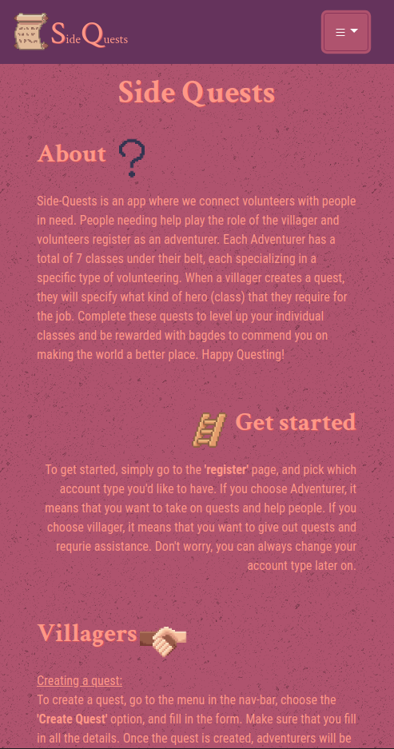
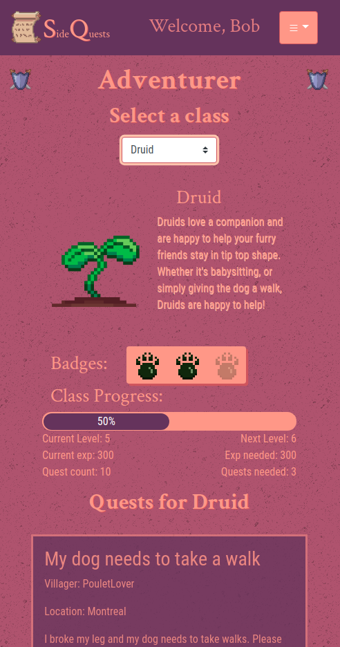
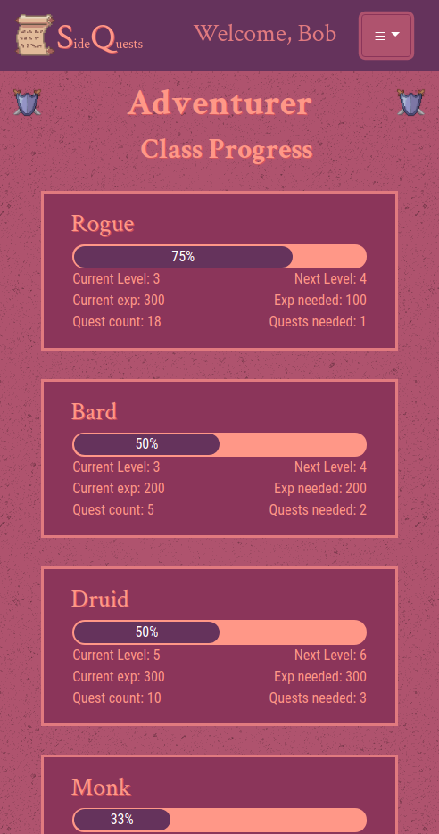
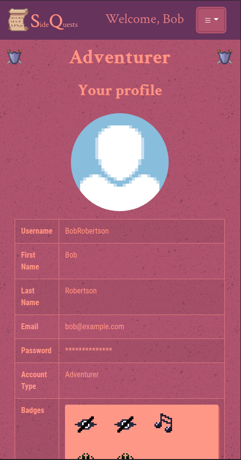
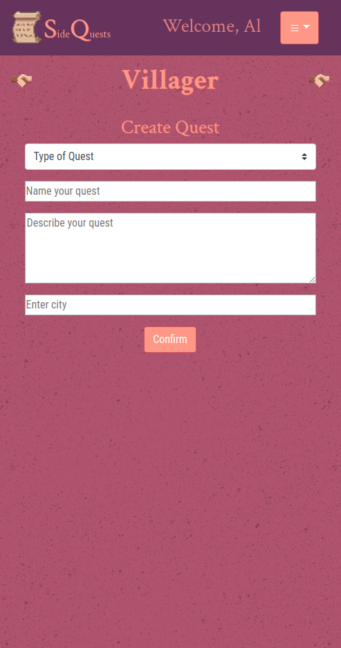
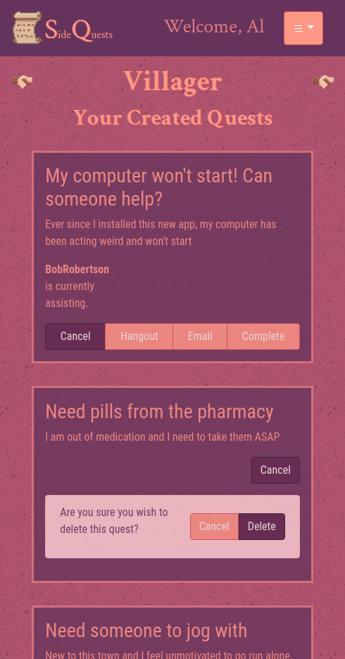
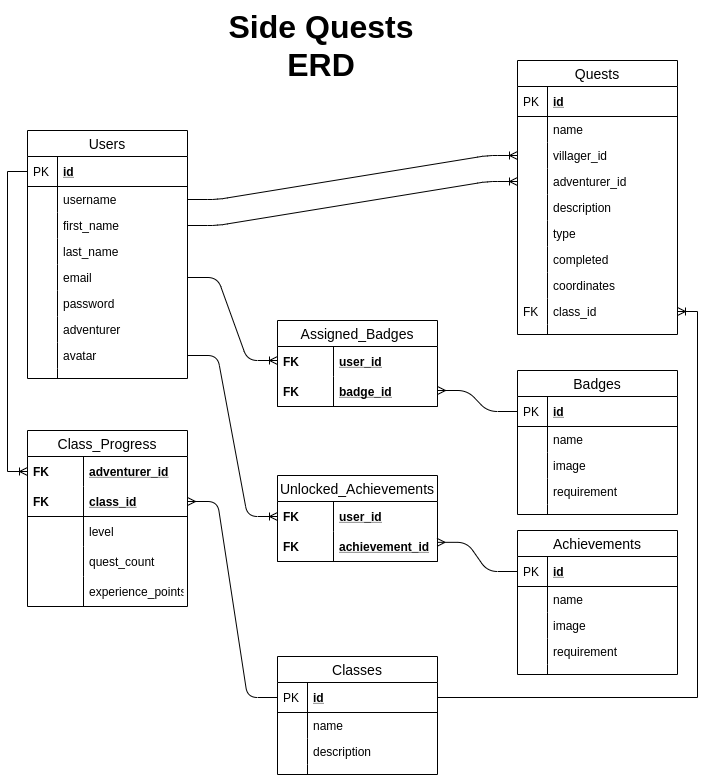

# Side Quests

SideQuests is a web app which facilitates helping people in need, solving current world issues on a small scale with a fun fantasy theme. As an adventurer, you can pick a class, view what villager requests are available to you in your area, and complete them to earn badges, and level up your character. As a villager, you can post a request, and get the help of an adventurer in your area depending on the request type.

## User Stories

- As someone who was recently diagnosed with a contagious disease and who has no family living nearby, I need to ask for help to run daily errands so that I won't spread the disease around.
- As someone who has mobility issues, I like to have a community of people who are willing to help me spontaneously.
- As an able bodied person, I am free to run errands. When I go to the pharmacy, I like to see if I can't also get something for someone who is unable to do the same.
- As someone who likes to do things right, I like to be able to ask details about the task that I'm asked to do.
- As someone with a lot of free time, I like to spend some time helping those who are most in need in my area.
- (stretch) As someone who still wants to pay for my own things, I like to be able to decide if my errand that I am asking for is free or if I will pay for it.

## Getting Started

To get started, you must install the dependencies in both the back-end and the front-end, and then run them in parallel.

### Getting the back-end ready:

1. Go to the back-end directory and run `npm install` to install all the dependencies;
2. Create a psql database, and seed it from the root directory `\i back-end/db/db_setup`;
3. Make a copy of the `.env.example`, rename it to `.env`, and fill in all the details;
4. Run `npm run dev`.

### Getting the front-end ready:
1. Go to the client directory and run `npm install` to install all the dependencies;
2. Make sure the back-end is ready and running;
3. Run `npm start`;
4. Go to http://localhost:3000 and enjoy _Side-Quests_.

## Stacks

### Front End
* React
* Scss
* Bootstrap

### Back End
* Express.js
* Node.js

### Database
* PostgreSQL

## Finishd Product

About page:

Class selection & available quests:

All quests that have been accepted:

Progress for all classes:

User profile:

Villager view, create a new quest:

Villager's created quests:

## Routes

| HTTP METHOD  | URL PATTERN        | USE                      |
| ------------ | :----------------- |--------------------------|
| POST         | /register          | Register new user        |
| POST         | /login             | Login existing user      |
| GET          | /users             | Get users                |
| GET          | /users/:id         | Get data for user        |
| GET          | /quests            | Get all the quests       |
| POST         | /quests/:id/new    | Add a new quest          |
| GET          | /quests/:id        | Get a single quest       |
| PUT          | /quests/:id/edit   | Edit a quest             |
| DELETE       | /quests/:id/delete | Delete a quest           |
| GET          | /badges            | Get all badges           |
| GET          | /badges/:id        | Get a single badge       |
| GET          | /classes           | Get all classes          |
| GET          | /classes/:id       | Get a single class       |

## ERD
